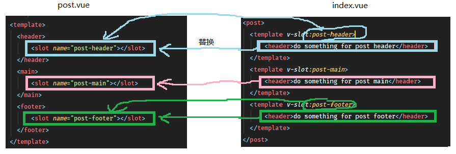

Vue-relearn
---------
这段时间开始重新学习`vue`，大半年的时间都在使用 react， 导致现在 vue 的语法都快忘光了，故从头回看一下。   

1. 常见的几个指令
    - v-on
    - v-bind
    - v-if (v-else, v-else-if)
    - v-for
    - v-show
    - v-model
    
2. vue 中的父子组件中的通信
    - 父传子        
    - 子传父
    
3. 插槽 (slot) <===> 类似于 react 里面的 props.children
    - 具名插槽
        默认情况下，插槽 (slot) 只可以使用一个，但是当我们想将一个组件下面的内容分成多个部分传入组件内部不同的地方的时候，就需要使用具名插槽，这可以允许我们定义多个插槽：   
        talk is cheap, show me some code:  
        ```html
        <!--假设我们有一个组件叫做 post-->
        <!--在 index.js 中引入 post 组件-->
        <!-- 在其内部现在定义一些内容，并使这些内容你能传入到组件内部 -->
        <post>
          <header></header>
          <main></main>
          <footer></footer>
        </post>
        <!-- 现在想将这三部分放在 post 组件内部的三个插槽中，而不是一个插槽，换句话说，就是不同的内容对应组建中不同的位置 -->  
      
        <!-- post.vue -->
        <template>
          <header>
              <slot name="post-header"></slot>
          </header>
          <main>
              <slot name="post-main"></slot>
          </main>
          <footer>
              <slot name="post-footer"></slot>
          </footer>
        </template> 
        <!-- 以上的组件内部的代码就是具名插槽的使用，当然，现在这种情况还不能正确的渲染出来，我们需要修改 index.js 文件中的内容为： -->
        <!-- index.js -->
        <post>
          <template v-slot="post-header">
              <header>do something for post header</header>
          </template>
          <template v-slot="post-main">
              <header>do something for post main</header>
          </template>
          <template v-slot="post-footer">
              <header>do something for post footer</header>
          </template>
        </post>    
        <!-- 注意，按照官方文档的说法，v-slot 指令一般是使用在 template 上面的，它的值需要指定为组件内部对应的 slot 中 name 属性的值  -->
        <!-- 这样，template 里面的内容就会被渲染到对应的插槽当中，这是一个一对一的关系 -->    
        ``` 
        简单的来说，这就是一个替换关系，下图的体现可能会更明显一些：
        